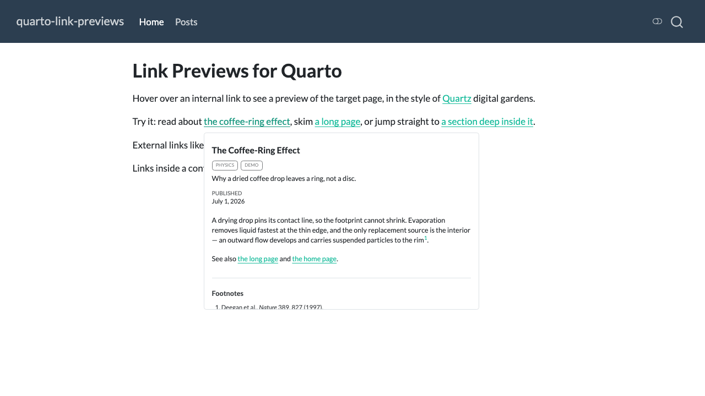
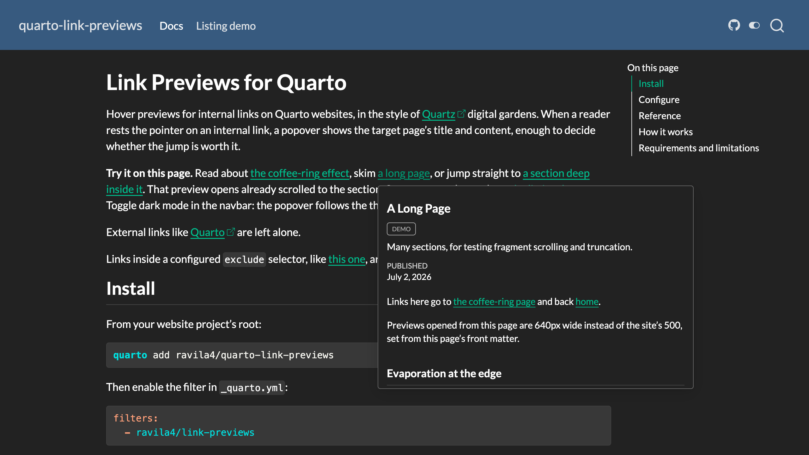

# quarto-link-previews

Hover previews for internal links on Quarto websites, in the style of
[Quartz](https://quartz.jzhao.xyz/) digital gardens and Obsidian's page
preview: hover a link to another page on your site and a popover shows the target's
title, date, and content without navigating away.

**Try it live:** the documentation site at
[ravila4.github.io/quarto-link-previews](https://ravila4.github.io/quarto-link-previews/)
runs the extension on itself.



There is no build step and no index to maintain. On hover, the target page is
fetched (same origin, so it is already on your host), the article content is
extracted, and it is displayed with the tippy.js instance Quarto already
ships for its footnote and cross-reference hovers. Previews match your site
theme, light and dark, automatically.



## Install

```bash
quarto add ravila4/quarto-link-previews
```

Then enable it for your website in `_quarto.yml`:

```yaml
filters:
  - ravila4/link-previews
```

## Configuration

All keys are optional, set under `link-previews:` in `_quarto.yml`
(site-wide) or in a page's front matter (per-page override):

```yaml
link-previews:
  content: "#title-block-header, #quarto-document-content"
  delay: [300, 0]     # show/hide delay in ms; scalar means show-delay only
  max-width: 500      # popover width in px
  exclude:            # links matching these selectors never preview
    - ".sidebar-recent a"
```

| Key | Default | Meaning |
|---|---|---|
| `enabled` | `true` | Kill switch; `false` in a page's front matter disables that page |
| `content` | `"#title-block-header, #quarto-document-content"` | Selectors extracted from the target page |
| `delay` | `[300, 0]` | tippy show/hide delay in ms |
| `max-width` | `500` | Popover max width in px |
| `exclude` | `[]` | Extra CSS selectors whose links never get previews |

Per-link opt-outs: add the `no-preview` class or a `data-no-preview`
attribute to any anchor.

### Styling

Popover colors come from Quarto's own tippy theme, so previews track your
site theme automatically. Three CSS custom properties tune the rest; set
them on `:root` in your site CSS:

```css
:root {
  --link-preview-font-size: 1rem;          /* default 1em ≈ 14px */
  --link-preview-border-color: #8a8d8f;    /* default: 30% of the text color */
  --link-preview-shadow: none;             /* default: soft elevation shadow */
}
```

## What gets previewed

Same-origin links to other HTML pages of the site, including links from
listing cards and grids. Links to another page's `#section` open the preview
scrolled to that section. Everything else is left alone: external links,
navigation chrome (navbar, sidebar, TOC, pagination), footnotes and
cross-references (Quarto's own hovers keep those), lightbox image links, and
downloads.

On default listing cards (which contain several anchors pointing at the same
post), the preview binds once per card, so sweeping the mouse across a card
does not flicker the popover.

## Requirements and scope

- Quarto ≥ 1.8.27 (the versions CI actually tests: 1.8.27 and current release).
- Previews use the tippy.js bundle Quarto ships with its hover features. If
  a future Quarto stops loading it, the extension logs one console note and
  does nothing else; links keep working normally.
- Hover is a pointer gesture: the extension is inactive on touch devices.

## Limitations

- Pages are previewed as static HTML: MathJax renders as source TeX, and
  script-driven figures (plotly, mermaid, OJS) appear empty or are stripped.
- Links injected after page load (search results dropdown, Shiny/OJS output)
  do not get previews.
- On default listing cards the preview binds to the card element, which never
  receives keyboard focus, so tabbing through card links shows no preview
  there (standalone links still preview on focus).
- Absolute self-links (`https://your-site.com/...`) are treated as external
  during `quarto preview` on localhost; they preview correctly in production.
- Sites behind a strict CSP with script nonces will block the module script,
  the same as all of Quarto's static JS.

## Development

```bash
npm test          # pure-logic suite (node --test, zero dependencies)
quarto preview    # repo root is the demo site, wired to _extensions/ directly
```

The URL, eligibility, config, binding-plan, and fetch-cache logic is unit
tested. Extraction and the tippy lifecycle are exercised through the demo
site rather than unit tests. (Node has no built-in HTML parser and the suite
deliberately has zero dependencies.) Treat changes to the DOM-glue section
of `link-previews.js` with corresponding care.

## License

MIT © Ricardo Avila
